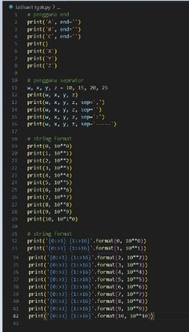
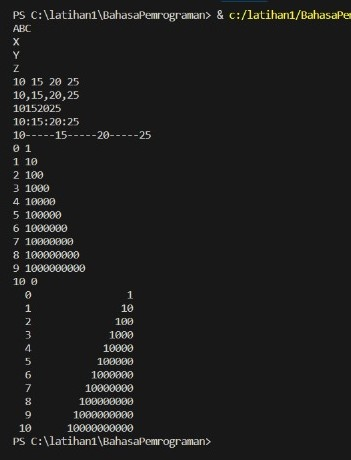
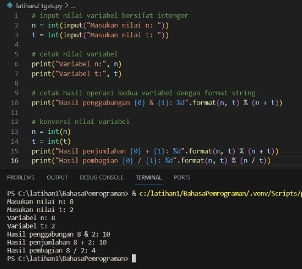
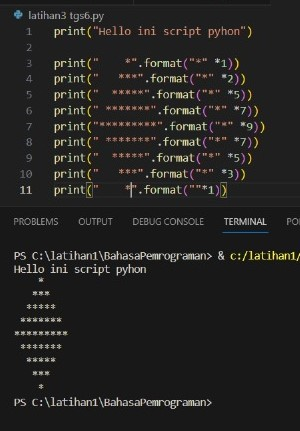
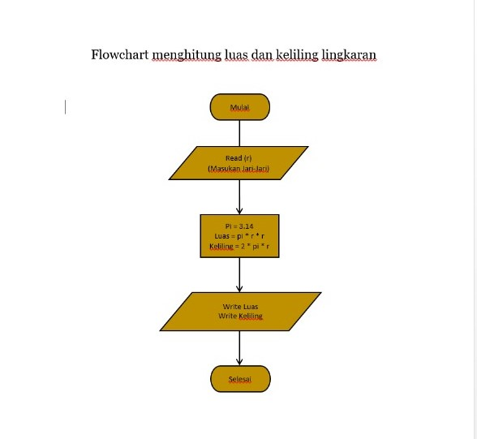

# Praktikum 3
> Tugas Bahasa Pemrograman | Universitas Pelita Bangsa

## Laporan Praktikum
### Latihan 1

    # penggunaan end
    print('A', end='')
    print('B', end='')
    print('C', end='')
    print()
    print('X', end='')
    print('Y', end='')
    print('Z', end='')

    # Penggunaan separator
    w, x, y, z = 10, 15, 20, 25
    print(w, x, y, z)
    print(w, x, y, z, sep=',')
    print(w, x, y, z, sep='')
    print(w, x, y, z, sep=':')
    print(w, x, y, z, sep='-----') 

    # string format
    print(0, 10**0)
    print(1, 10**1)
    print(2, 10**2)
    print(3, 10**3)
    print(4, 10**4)
    print(5, 10**5)
    print(6, 10**6)
    print(7, 10**7)
    print(8, 10**8)
    print(9, 10**9)
    print(10, 10**10) 
 
    # string format
    print('{0:>3} {1:>16}'.format(0, 10**0))
    print('{0:>3} {1:>16}'.format(1, 10**1))
    print('{0:>3} {1:>16}'.format(2, 10**2))
    print('{0:>3} {1:>16}'.format(3, 10**3))
    print('{0:>3} {1:>16}'.format(5, 10**5))
    print('{0:>3} {1:>16}'.format(6, 10**6))
    print('{0:>3} {1:>16}'.format(7, 10**7))
    print('{0:>3} {1:>16}'.format(8, 10**8))
    print('{0:>3} {1:>16}'.format(9, 10**9))
    print('{0:>3} {1:>16}'.format(10, 10**10))
* End: Parameter end digunakan untuk menentukan karakter apa yang harus dicetak di akhir baris. Pada bagian pertama kode, end='' digunakan untuk mencetak 'A', 'B', dan 'C' tanpa spasi atau baris baru di antara keduanya. Pernyataan print() kedua digunakan untuk mencetak karakter baris baru.
* Pemisah: Parameter sep digunakan untuk menentukan karakter apa yang harus dicetak di antara beberapa nilai. Pada bagian kedua kode, sep=',' digunakan untuk mencetak koma antara nilai w, x, y, dan z. Pemisah lain seperti '', ':', dan '-----' juga digunakan untuk menunjukkan berbagai cara memformat output.
* Pemformatan String: Metode format() digunakan untuk memformat string dengan nilai. Di bagian ketiga kode, metode format() digunakan untuk mencetak nilai 0 hingga 10 beserta pangkat 10 yang sesuai. Bagian :>3 dan :>16 dari string format digunakan untuk menentukan nilai minimum lebar bidang dan perataan nilai di dalam bidang.

>Contoh

>Output

### Latihan2

    n=input("masukkan nilai n:")
    t=input("masukkan nilai t:")
    print("Variable n=",n)
    print("Variable t=",t)
    print("Hasil penggabungan {0}&{1}={2}".format(n, t, n+t))

    # konversi nilai variable
    n=int(n)
    t=int(t)
    print("Hasil penjumlahan {0}+{1}={2}".format(n, t, n+t))
    print("Hasil pembagian {0}/{1}={2:.2f}".format(n, t, n/t))

* Fungsi 'input()' digunakan untuk mendapatkan input pengguna dari konsol. Baris pertama meminta pengguna memasukkan nilai 'n', dan baris kedua meminta pengguna memasukkan nilai 't'.
* Nilai yang dimasukkan oleh pengguna ditetapkan ke variabel 'n' dan 't' menggunakan operator penugasan '='.
n=ke dalam(n)
* Metode 'format()' digunakan untuk memformat string dengan nilai. Pada baris ketiga kode, metode 'format()' digunakan untuk mencetak nilai 'n' dan 't' beserta penggabungannya menggunakan operator '+'. Kurung kurawal '{}' digunakan sebagai pengganti nilai, dan metode 'format()' menggantikannya dengan nilai sebenarnya.
* Nilai 'n' dan 't' diubah dari string menjadi bilangan bulat menggunakan fungsi 'int()'. Hal ini diperlukan karena operator '+' hanya dapat digunakan dengan bilangan bulat, bukan string.
* Metode 'format()' digunakan lagi untuk mencetak jumlah dan hasil bagi 'n' dan 't'. Bagian ':.2f' dari string format digunakan untuk menentukan bahwa hasil bagi harus dibulatkan menjadi dua tempat desimal.

>Contoh

### Latihan3

   print("Hello ini script pyhon")

 print("    *".format("*" *1))
 print("   ***".format("*" *2))
 print("  *****".format("*" *5))
 print(" *******".format("*" *7))
 print("*********".format("*" *9))
 print(" *******".format("*" *7))
 print("  *****".format("*" *5))
 print("   ***".format("*" *3))
 print("    *".format("*" *1))

* Baris pertama kode mencetak pesan sederhana menggunakan fungsi print().
* Sembilan baris kode berikutnya menggunakan pemformatan string untuk mencetak bentuk belah ketupat. Metode format() digunakan untuk menyisipkan string tanda bintang (*) ke dalam string templat yang menyertakan spasi dan karakter baris baru. Jumlah tanda bintang di setiap baris bertambah dari 1 menjadi 9 dan kemudian berkurang kembali menjadi 1, sehingga menciptakan bentuk belah ketupat.
* Setiap garis bentuk wajik dicetak menggunakan fungsi print(). Metode format() digunakan untuk menyisipkan string tanda bintang yang sesuai ke dalam string templat.

>Contoh

### Lingkaran
    import math

    # Input jari-jari lingkaran dari pengguna
    jari_jari = int(input("Masukkan jari-jari lingkaran: "))

    # Hitung luas lingkaran
    luas = math.pi * jari_jari ** 2

    # Hitung keliling lingkaran
    keliling = 2 * math.pi * jari_jari

    # Tampilkan hasil
    print(f"Luas lingkaran: {luas:.2f}")
    print(f"Keliling lingkaran: {keliling:.2f}")

* Import math : memanggil modul matematika bawaan python
* line 4 : membuat variabel untuk mengambil input jari - jari bertipe integer
* line 7 : menghitung luas menggunakan math pi operasi matematika python bertipe data float
* line 10 : menghitung keliling lingkaran dan memanggil input jari-jari
* line 13 : menghasilkan output luas menggunakan f string
* {luas:.2f} : memanggil output dari variabel luas dan keliling berupa float dengan maks output 2 angka setelah koma (.)
* line 14 : menghasilkan output keliling menggunakan f string

>Contoh

### Flowchart

* Masukkan jari-jari lingkaran (r)
* Hitung Luas Lingkaran dengan rumus L = pi * r * r
* Hitung Keliling Lingkaran dengan rumus K = 2 * pi * r 
* Tampilkan Luas Lingkaran
* Tampilkan keliling lingkaran
